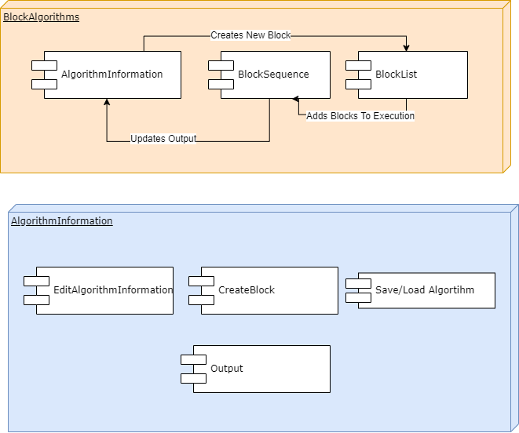
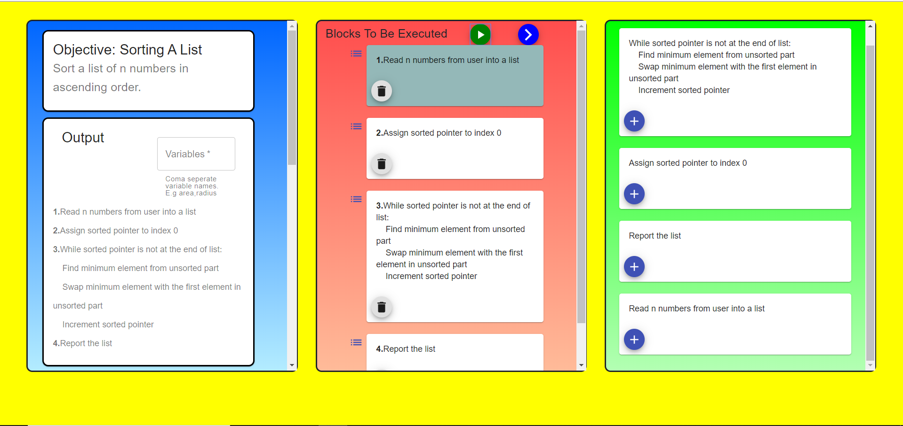

Block Algorithms is a web application developed for CS489 - Teaching Project in Computer Engineering course in Bilkent University.
Aim of the application is to provide a tool to develop drag-drop algorithms for given problems.

## Live Website
https://gifted-kepler-d8bba3.netlify.com/

## Components

   

## Snapshot
   
